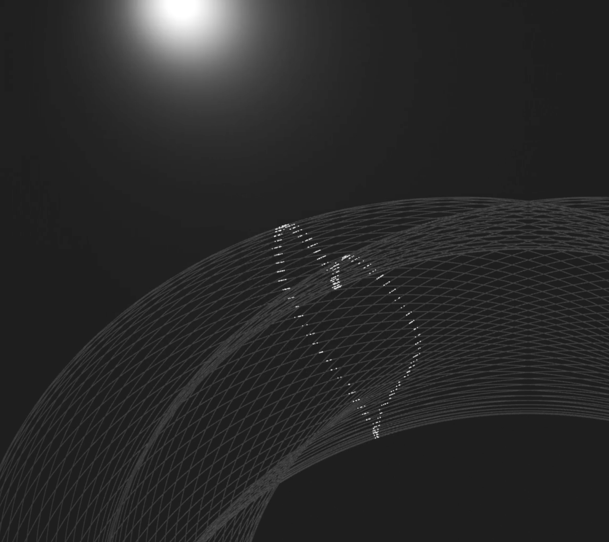

## 划痕全息教程

### 原理讲解

划痕全息是一种视觉效果，当光源移动时，高光会随之改变。这种效果可以通过特定的方法在三维软件中实现，例如Blender。

### 主要做法

1. 确定轮廓点

    首先，我们需要确定我们想要绘制图案的轮廓点。这些点将作为我们绘制圆弧的基准。

2. 绘制圆弧

    通过这些采样点绘制相同曲率的圆弧。这样可以确保在不同位置的高光变化是一致的。

3. 保存轨迹路径

    将绘制的轨迹路径保存为SVG格式。SVG是一种矢量图形格式，适合用于保存精确的路径数据。

4. 导入Blender

    将SVG文件导入到Blender中。可以使用快捷键`Control + J`将曲线合并。

5. 设置曲线

    在Blender中，打开曲线设置，将倒角深度设置为`0.0001`。这个设置将影响高光的显示效果。

6. 更改材质

    将材质的金属度拉满，粗糙度设置为0

7. 创建点光源

    在Blender场景中创建一个点光源。点光源的辐射半径需要缩小，以便更精细地控制高光。

8. K帧动画

    一旦高光形状符合预期，就可以对光源或者相机进行K帧（关键帧）设置，以创建动态的全息效果。